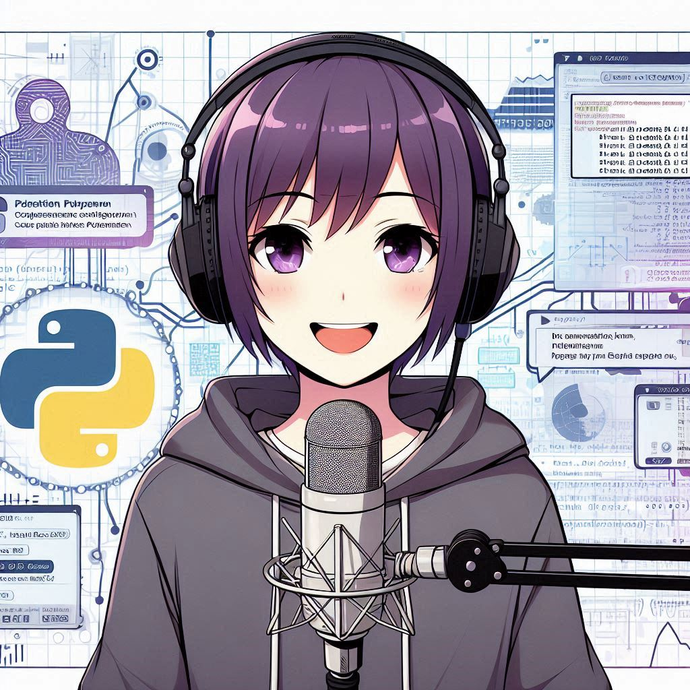

## Olá, comunidade!

Que experiência maravilhosa!🎉

Acabei de criar um episódio de podcast usando IA´s Generativas.

Este projeto foi desenvolvido para o Bootcamp Santander 2024 - Fundamentos de IA para Devs, com as aulas de [Felipe Silva Aguiar](https://www.linkedin.com/in/ACoAABLpUBgBQzTIZyVSL0M4NMZu0mXvv5wCRQ8).

&nbsp;

### 🎵 Nome do Podcast: "A Sociedade do Código - Aventuras e Dicas no Mundo Python"

&nbsp;

## 💻 Tecnologias utilizadas no projeto

- [ChatGPT](https://chat.openai.com/) 👉 elaboração de roteiro
- [Bing - Copilot](https://www.bing.com/images/create?cc=br) 👉 elaboração de imagens de capa
- [ElevenLabs](https://elevenlabs.io/) 👉 elaboração do audio
- [Capcut](www.capcut.com) 👉 tratamento do audio

&nbsp;

### 🧠 Prompts

#### ✨ ChatGPT:

▶️ Título:

    Você é um roteirista de podcast, e vamos criar um podcast de tecnologia, focado em Python e eu gostaria
    de uma ajuda sua para criar 5 sugestões de nomes criativos para um podcast de Python feito por nerds, e 
    que tenha algum trocadilho nerd no nome.
    
    O podcast vai falar sobre dicas e novidades sobre o mundo do Python e o que está acontecendo no mercado
    
    {REGRAS}
    > O nome deve ser enxuto, um nome e um subtítulo
    > O nome tenha algum trocadilho nerd com nomes de franquias conhecidas como harry potter, star wars ou senhor dos anéis
    > O nome deve conter alguma palavra forte que remeta a Python
    
    {REGRAS NEGATIVAS}
    > Não quero que o título contenha palavras em inglês
    > Não quero que utilize nenhuma das palavras nessa lista: programador
    > Não utilize a palavra Python no nome nem qualquer variação dela

▶️ Idéias para imagem da capa:

    Escolho: A Sociedade do Código - Aventuras e dicas no mundo Python
    Me dê 5 sugestões de imagens para uma capa do meu podcast

▶️ Idéias para curiosidades:

    Quais assuntos poderiam ser abordados como curiosidades em Python?

▶️ Roteiro:

    Você é um roteirista de podcast, e vamos criar um  roteiro de um podcast de tecnologia, focado em Python
    cujo o nome é "A Sociedade do Código - Aventuras e dicas no mundo Python" e tem foco em linguagem de 
    programação Python,  com o público alvo de iniciantes nessa linguagem
    
    o formato do roteiro deve ser
    [INTRODUÇÃO]
    [CURIOSIDADE 1]
    [CURIOSIDADE 2]
    [FINALIZAÇÃO]
    
    {REGRAS}
    > no bloco [INTRODUÇÃO] substitua por uma introdução igual às introduções dos vídeos do canal 'ei nerd', como se fossem escritos pelo Peter Jordan
    > no bloco [CURIOSIDADE 1] substitua por uma curiosidade de automação
    > no bloco [CURIOSIDADE 2] sobre uma biblioteca inusitada
    > no bloco [FINALIZAÇÃO] substitua por uma despedida cool com o final 'Eu sou Erika e essa foram as aventuras da Sociedade do Código dessa semana'
    > use termos de fácil explicação
    > O podcast vai ser apresentado somente por uma pessoa, chamada Erika
    > O podcast deve ser curto
    
    {REGRAS NEGATIVAS}
    > Não use muitos termos técnicos
    > Não ultrapasse 5 minutos de duração

#### ✨ Copilot:

▶️ Imagem de Capa:

    Ilustração ou desenho digital com um estilo moderno e vibrante de uma jovem podcaster com cabelo curto 
    e roxo com um visual estiloso e contemporâneo, vestindo uma camiseta com o símbolo da linguagem de 
    Programação Python estilizado e usando um headset com design futurista. Ela está sorrindo de maneira 
    amigável e entusiasmada, transmitindo paixão e acessibilidade. Ao fundo está o espaço estelar com estrelas 
    brilhantes, nebulosas coloridas e planetas ao longe, criando uma sensação de aventura e vastidão. Utilize 
    uma paleta de cores vibrantes e contrastantes, como roxo, azul e dourado, para criar uma capa visualmente 
    impactante e coerente com o cabelo da podcaster.

&nbsp;

## 📚 Materiais

Confiras as imagens deste projeto na pasta `Imagens`.

O podcast está na pasta `Audio`.

&nbsp;

### Conecte-se comigo 💻

### Habilidades

 

### GitHub Stats

